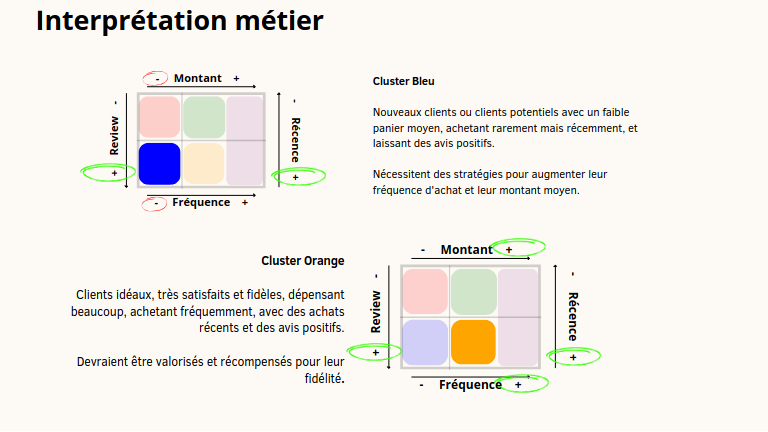

# Segmentation des Clients d'un Site E-commerce

  

## Contexte

En tant que consultant pour **Olist**, une entreprise brésilienne spécialisée dans les solutions de vente sur les marketplaces en ligne, j'ai été chargé de segmenter les clients de la plateforme. L'objectif est de fournir à l'équipe Marketing d'Olist une segmentation exploitable des clients, qui permettra d'optimiser leurs campagnes de communication et d'améliorer la satisfaction client.

## Objectif du Projet

Le projet consiste à :
1. Réaliser une segmentation des clients basée sur leurs comportements et données personnelles à l'aide de méthodes d'apprentissage non supervisé.
2. Proposer une recommandation pour la fréquence de mise à jour de cette segmentation afin d'assurer sa pertinence dans le temps.

## Étapes de l'Analyse

1. **Requêtes SQL** :
    - Rédaction des requêtes SQL nécessaires pour alimenter le Dashboard Customer Experience d'Olist.

2. **Analyse Exploratoire** :
    - Exploration des données fournies par Olist pour comprendre les distributions, identifier les variables pertinentes et préparer les données pour le clustering.

3. **Modélisation et Segmentation** :
    - Essais et comparaison de différentes approches de modélisation pour réaliser la segmentation.
    - Sélection du modèle de segmentation le plus adapté, en tenant compte de la nature des variables et des objectifs métier.

4. **Simulation de Fréquence de Mise à Jour** :
    - Simulation pour déterminer la fréquence optimale de mise à jour du modèle de segmentation, afin d'assurer sa pertinence à long terme.

## Livrables

- **Script SQL** : Contient les requêtes SQL demandées pour alimenter le Dashboard Customer Experience.
- **Notebook d'Analyse Exploratoire** : Document non cleané montrant la démarche d'exploration des données.
- **Notebook d'Essais de Modélisation** : Document non cleané détaillant les différentes approches de modélisation testées.
- **Notebook de Simulation** : Présente la simulation réalisée pour déterminer la fréquence de mise à jour du modèle de segmentation.
- **Support de Présentation** : Un document de présentation préparé pour exposer les résultats à un collègue avant présentation à Olist.

## Soutenance

La soutenance consiste à présenter :
- La problématique, le nettoyage des données, le feature engineering, et l'analyse exploratoire.
- Les différentes approches de modélisation testées et le modèle final sélectionné.
- La simulation pour déterminer la fréquence de mise à jour du modèle.

### Visionner la Soutenance

Vous pouvez visionner l'enregistrement de la soutenance à l'adresse suivante : [Lien vers la vidéo](https://youtu.be/JkEdzrx_EUg?si=PwpjSnmPfh7FRaq6).

## Contact

Pour plus d'informations sur moi ou pour accéder à mes coordonnées, veuillez visiter mon site web : [alexandre.rogues.fr](https://alexandre.rogues.fr).

Merci de l'intérêt que vous portez à ce projet !

